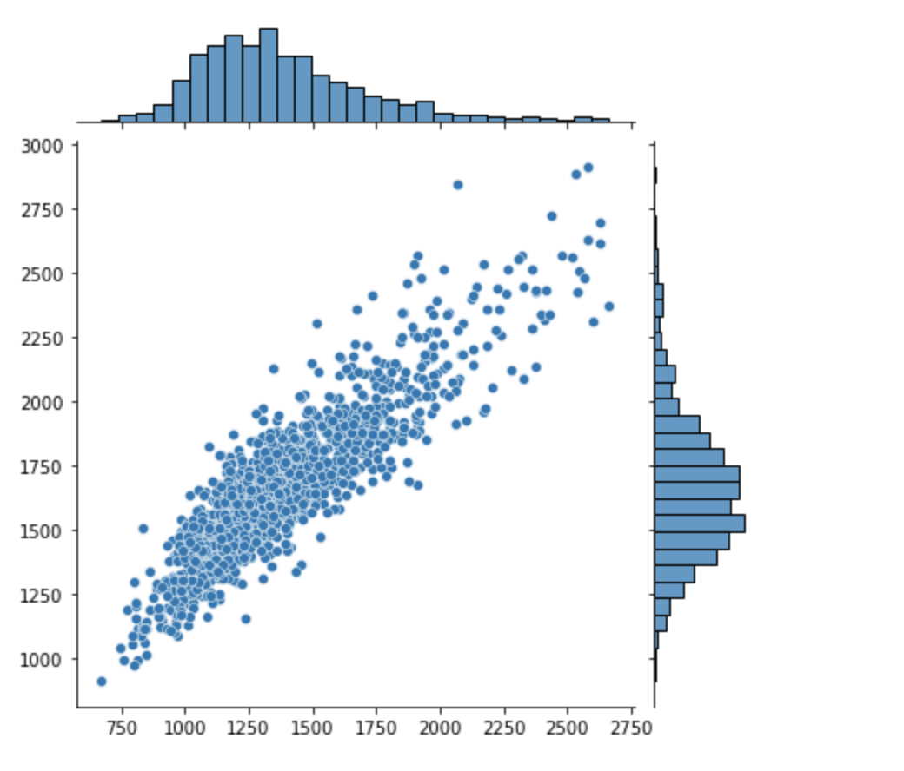

# T-DEV-810 - PROJECT 

## Objectif 

Nous avons traité jusqu'à présent des ensembles d'images préalablement condirionnés (voir bootstrap et le dataset MNIST). 

Nous allons maintenant traité le cas relatif au travail avec des fichiers d'images réelles au format .jpeg

Notre objectif va être de réaliser un model (CNN) capable de prédir à partir d'une image (radio des poumons), si le patient est infecté par la bactérie de la pneumonie ou non.

## Notebook 

### Création du notebook

On va créer notre jupyter notebook

On va d'abord récupérer nos datasets ```test``` et ```train```

```
import os

# On récupère le dossier qui contient nos datasets
data_dir = 'chest_Xray'

os.listdir(data_dir)
# [‘.DS_Store', 'test', 'train', 'val']
```

## Datasets

On va d'abord installer les différentes dépendences dont on va avoir besoin: 

```
# On importe nos différentes dépendences
import pandas as pd
import numpy as np
import seaborn as sns
import matplotlib.pyplot as plt
```

On va récupérer la methode de matplotlib qui nous permet de lire les images: 

```
# Va nous permettre de lire directement un fichier image
from matplotlib.image import imread
```

On va récupérer le chemin de chaque dataset:

```
# On récupère le chemin pour les data de test
test_path = data_dir + '/test'

# Puis le chemin pour les data d'entrainement
train_path = data_dir + '/test'
```

On va ensuite lister les deux types de dataset qu'on retrouve dans celui de test: 

```
os.listdir(train_path)
```

On se retrouve donc avec les images qui représentent une radio avec des poumons normaux (non infectés) et des poumons infectés par la pneumonie (bactérie)

## Datavisualization

### Radio de poumons infecté 

On va d'abord voir à quoi ressemble une image d'un poumon infecté: 

```
# Je récupère le chemin d'une image dans le cas d'un poumon infecté
pneumonia_x_ray = train_path + '/PNEUMONIA/' + os.listdir(train_path + '/PNEUMONIA')[0]
```

Je vais ensuite utiliser ma fonction ```imread()``` pour pouvoir lire l'image

```
imread(pneumonia_x_ray)
```

Notre image au format .jpeg est transformé en un tableau comme pour les images du MNSIT.

On peut ensuite vérifier la shape de notre tableau: 

```
imread(pneumonia_x_ray)
# (736, 1048)
```

On peut également visualiser l'image de la radio 

```
plt.imshow(imread(pneumonia_x_ray))
```

### Radio de poumons sains

Maintenant on va faire le même travaille de data-visualisation pour des poumons sains.

```
### On récupère la première image du dataset d'entrainement pour les poumons normaux (sains)
normal_x_ray = train_path + '/NORMAL/' + os.listdir(train_path + '/NORMAL')[0]
```

```
### On peut visualiser la radio pour les poumons non infectés par la pneumonie
plt.imshow(imread(normal_x_ray))
```

### Visualisation du format des images 

On va visualiser les dimensions de nos images dans le dataset d'entrainement pour connaitre si il existe ou non une trop grande disparité dans les dimensiosn des images (images dans des dimensions trop différentes). En effet notre CNN à besoin d'être entrainé sur des images dans des dimensions identiques. Les images réelles sont de fait dans des formats différents. 

```
# Chaque image est transformé en tableau de format d1*d2, e.g: pour la 1ère image de train => (736, 1048)
# Pour entrainer correctement notre CNN correctement, nous avons besoin de l'entrainer sur des images relativement de la
# même taille. Les dimensions d'images doivent donc être le moins disparâtre possible. 
# Pour se faire nous allons essayer de visualiser ces données.

# Dans un premier temps nous allons récupéré les dimensions pour chaque image d'un dataset (train) et les stocker
dim1 = []
dim2 = []
test = 'Hello World'

# On va ensuite itérer la liste des fichier (images) de notre dataset d'entainement (normaux) pour récupérer le chemin de chaque image
for x_ray_filename in os.listdir(train_path + '/NORMAL'):
    img = imread(train_path + '/NORMAL/' + x_ray_filename)
    d1,d2 = img.shape
    dim1.append(d1)
    dim2.append(d2)
```

On va ensuite utiliser un historigramme pour visualiser cette disparité dans les dimensions des images: 

```
sns.jointplot(dim1, dim2)
```

Voici le résultat: 



On va donc maitenant définir les dimensions avec laquelle nous allons donc redimensionner nos images:

```
np.mean(dim1)
# 1381.43
```

```
np.mean(dim2)
# 1667.73
```

Notre shape finale sera donc: 

```
image_shape = (1380, 1668)
```


## Traitement des données 

L'objectif va être de manipuler nos images pour ensuite pouvoir les donner à notre model. 

### Objectif 

Lorsqu'on utilise des CNN, on a besoin de beaucoup d'image, donc l'objectif serait à partir de notre dataset transformé les images pour obtenir plus de données. C'est ce qu'on appelle la ***data augmentation***.

L'autre objectif est la réduction de pixel présent dans une image, avec (1380, 1668) c'est plus de 2 000 000 de point. Pour fournir un réseau de neurone on a besoin de réduire la shape des images. C'est ce qu'on appelle l'***image normalization***

### Image Normalization 

Lorsqu'on travaille avec des réseaux de neurone un des principaux objectifs dans le traitement des images est une mise à l'échelle. Ce qu'on entends par là c'est manipuler les données pour qu'elles obtiennent les mêmes dimensions.

#### Keras 

Keras fournis une classe ImageDataGenerator pour mettre à l'échelle les images en pixel.


