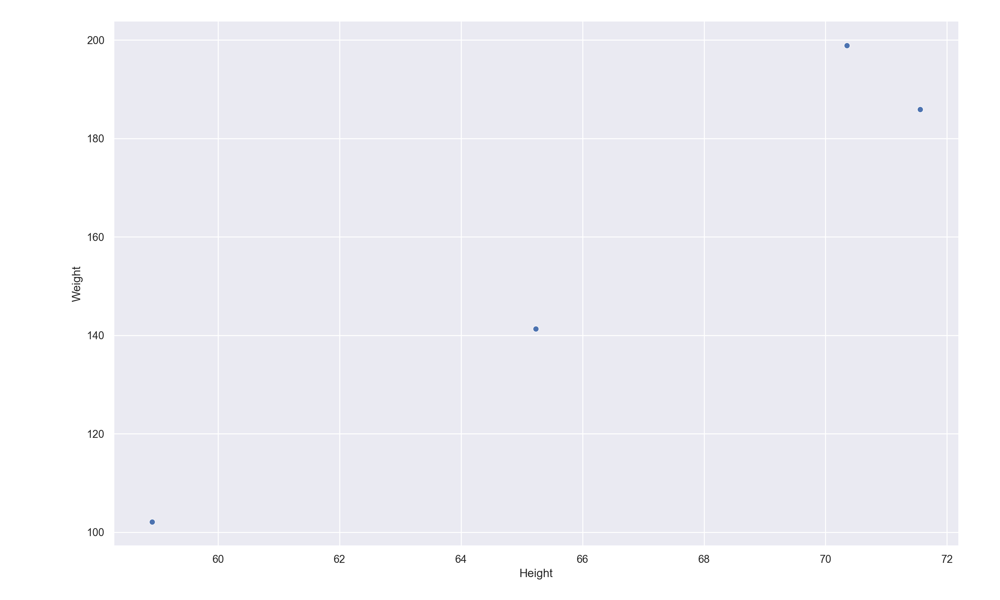
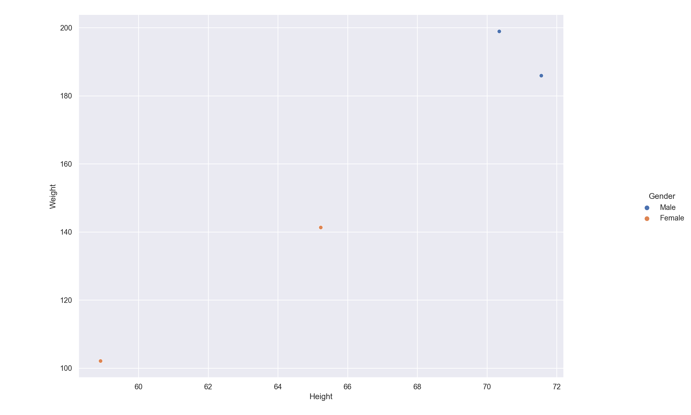
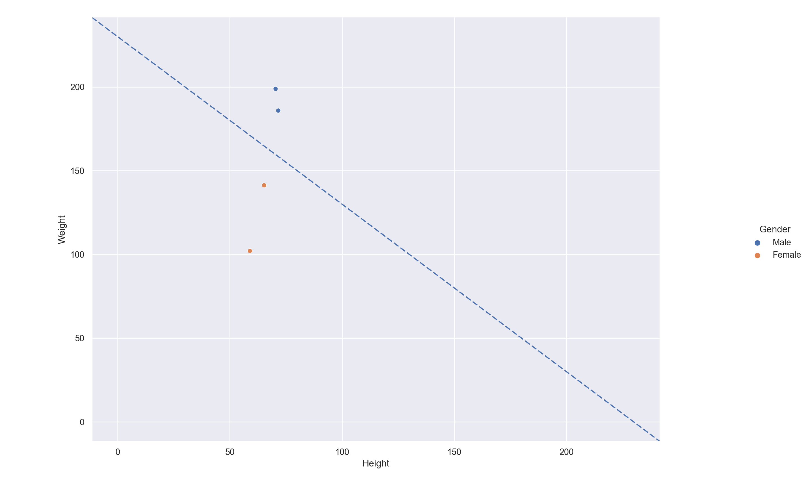

# Introduction

## Intelligence artificielle 

L'objectif du développement d'une intelligence artificielle consiste à programmer une machine capable d'imiter les fonctions cognitives humaines, qu'on appelle "intelligence naturelle". 

Pendant la plus grande partie de l'histoire de l'informatique, les humaines ont surtout tenter de reproduire le fonctionnement de la pensée logique pour prgrammer des machines capables de résoudre des tâches précises. Cela est rendu possible par création d'alogorithme (suite d'instruction plus au moins complexe) qui va être exectuté par la machine. Cependant le point faible d'une approche alogorithmique est le manque de fléxibilité. En effet, sans intervention de l'homme pour modifier l'algorithme, la machine va executer la suite d'instruction toujours de la même manière. De ce fait si mon algorithme prend un Input A comme "information d'entrée", alors il donnera toujours le même Output B comme "information de sortie". De plus le défaut d'un algorithme, est qu'il ne peut pas s'adapter à un cas particulier pour lequel il n'a pas été conçu spécifiquement. 

### Exemple: Alfred, le robot cuistot.

Trouver des bonnes recettes à réaliser avec les ingrédients que vous aimez ou qui trainent à la maison. L'objectif d'Alfred le robot cuistot est de vous proposer des recettes en fonction des aliments qu'on lui propose.

Gérer une telle problématique avec une approche basé sur un algorithme est un casse tête avec une compléxité toujours croissante. 

En effet il serait nécessaire de prévoir et anticiper tous les aliments qui pourrait être proposé et l'infinité de combinaison possible entre les aliments. 

Effectivement, si à chaque fois qu'on rencontre un cas de combinaison d'aliment qui ne rentre pas dans ce qui a été prévu par les développeur du robot, alors il faudrait revenir sur cet algorithme et le réparer pour qu'il prévoit ce cas précis. 

Avec cette approche, on fini par tomber dans un dédale de cas particilier, de condition spéciale et de minutie. 

C'est pour cela que les développeur se sont dirigés vers une solution plus fléxible: L'intelligence artificielle.

## Mais qu'est ce que l'intelligence ?

La caractéristique clé de l'intelligence est ***l'adaptation***.  


> L'intelligence est un procesus mise en oeuvre pour atteindre un objectif. Elle est capable de modifier sa configuration logique au cours des différentes tentatives qu'elle expérimente pour atteindre ce but, si elle mesure que l'objectif qui devait être atteint ne l'a pas été, pour qu'a la prochaine tentative ce but soit atteint.
> 

### Exemple: Reconnaissance d'image 

Si mon intelligence artificielle à pour objectif: ***Reconnaitre un chiffre entre 0 et 9 sur une image donnée***

Si par exemple cours d'une des tentatives (ou itérations) pour reconnaitre le chiffre "3" sur une image passée en entrée, qu'elle échoue et donne pour résultat 9, alors l'intelligence artificielle va modifer sa configuration logique interne de manière à qu'à la prochaine tentative de reconnaitre un "3", elle donne le bon résultat en sortie.

C'est cette ***fléxibilité*** qui constitue l'incroyable potentielle de l'intelligence artificielle. 

# Les réseaux de neurones

Un réseau de neurones artificiels est une approche visant à developper une intelligence artificielle. Elle est basé sur l'objectif d'imiter la structure et le fonctionnement d'un réseaux de neurones naturel qu'on peut retrouver dans le cerveau humain. 

Les neurones humains sont mis en relation les uns avec les autres au sein de structure très complèxes et communique au travers de signaux par impulsion electrique. 

Les réseaux de neurones artificiels sont une tentative d'imiter ces structures et ce fonctionnement de manière simplifié. C'est donc un ensemble de neurone artificiel interconnectés. 

## Le neurone artificiel 

Le neurone artificiel est la brique élémentaire d'une structure plus complexe. Dans le but de simplifier les choses, on peut le résumé à une entité qui possède sa propre configuration interne (en d'autres termes ses propres "réglages") qui peut être modifié au cours du temps. ***Ce n'est pas quelque chose de "figé"***.

Comme un neurone naturel, il peut prendre une ou plusieures "informations" en entrée et en fonction de sa configuration interne, donne une certaine information en sortie.

Un neurone artificiel seul est la structure de réseaux de neurone la plus simple avec laquelle on peut travailler.

Comme toute forme d'intelligence artificielle, le neurone artificiel va être programmer pour atteindre un objectif particulier. Cet objectif est basé en général sur la résolution d'un ***problème de classification***.

## Problème de classification

C'est un sujet central des résaux de neurones artificiels. Voici une définition: 

> Problèmes résolues par une machine ayant pour but de grouper des données selon des caractéristiques prédéfinies

L'objectif est d'entrainer une machine à reconnaitre certaines caractéristiques particulières d'une information, pour être capable de traiter et classer des informations futures en fonction de ces critères. 

Pour entrainer une machine nous avons besoin d'un ensemble de données qui possèdent les caractéstiques particulières à reconnaitre. Dans cet ensemble, chaque information est associé à la catégorie qui la représente. Grâce à cela la machine va au fil de l'entraintement pouvoir associé certaines cateristiques à la catégories correspondantes. On parle dans cas là d'apprentissage supervisé, car c'est l'intervention humaine qui permet à la machine d'apprendre.

Pour comprendre comment est conçu cet ensemble de données, nous devons introduire un nouveau concept: ***le Dataset***. 

## Dataset

Le dataset est un ensemble de données classées par catégories selon certaines caractéritiques préféfinies à partir desquelles il est possible de réaliser des statistiques, c'est à dire des prédictions. Ces prédictions vont visé à determiner à partir des caratéritiques prédéfinies, si telle ou telle données appartient à telle ou telle catégorie. 

>Exemple de dataset: Le poids et la taille d'un être humain selon le sexe.

Ici, les caratéristiques prédéfinies sont ***le poids*** et ***la taille***. On peut retrouver un exemple de dataset basé sur ces caratéristiques [sur github](https://gist.github.com/nstokoe/7d4717e96c21b8ad04ec91f361b000cb)

| Gender |      Height      |      Weight      |
|--------|:----------------:|:----------------:|
| Male   | 71.5577184876743 | 185.905909489285 |
|   Male | 70.3518798786343 | 198.903011944154 |
| Female | 58.9107320370127 | 102.088326367840 |
| Female | 65.2300125077128 | 141.305822601420 |

### Nuage de point

A partir de ce dataset, il est possible de visualiser les données sur un graphique. Les caractéristiques vont être les coordonnées en abscisse (taille) et en ordonnée (poids), et donc à chaque point va correspondre un individu:



Si les caractéristiques correspondent à un individu du genre masculin, on va colorer le point en bleu. Si c'est un individu du genre féminin on va colorer le point en orange. On dit que les points coloré par ***class label***, le genre est la classe qui permet de catégorisé les points.



La question à se poser est la suivante: ***Existe-t-il une ligne qui peut séparer les points de ce nuage, de telle manière que les points corresponsant à une même catégorie soient dans la même zone ?***

Effectivement on peut voir une claire séparation entre les points d'un genre différent. De ce fait, la combinaison de caractéristiques qui correspondent à un homme et celles qui correspondent à une femme sont séparé par une ligne qu'on appelle ***decision boundary***.



## Decision boundary

Dans notre cas nous avons placer une decision boundary tel que ```b = 250```. C'est à dire que nous avons tracer une ligne entre les deux points de coordonnées ```[250, 0]``` et ```[0, 250]```. On appelle ```b``` le "bias". Au dessus de cette ligne les points correspondent à des individus de genre "male" et en dessous des individus de genre "female".

### Les inputs

Dans un soucis de simplification et pour se rapprocher du lexique des neurones artificiel, nous allons à partir de maintenant nommer les combinaisons de caractéristique pour un point donné avec le terme "Inputs". 

>Exemple: Le premier point à pour inputs Input1 = 71.5577184876743 et Input2 = 185.905909489285

On remarque deux choses: 

+ Si ```Input1 + Input2 > b```, alors la combinaison de caractéristique correspond au type ```male```
+ Si ```Input1 + Input2 < b```, alors la combinaison de caractéristique correspond au type ```female```

A partir de cette relation on peut donc maintenant classer nos informations d'entrée selon une catéagorie.

=> Neurone actif ou non ? 

=> Sigmoid ?

=> Layer ? Deep ?

### Exemple: Reconnaissance d'image 

Rappelons l'objectif de notre machine: ***Reconnaitre un chiffre entre 0 et 9 sur une image donnée***

On va donc entrainer notre machine avec un ensemble d'entraintement (dataset). C'est simplement un ensemble d'image qui représente un chiffre de 0 à 9, étiquetées avec le chiffre que cette image représente. Voici un exemple simple de dataset pour ce cas:

| Index de l'image  | Etiquette  |
|---|:-:|
| Image 1  | 9  |
|  Image  2 |  3 |
|  Image  3 |  5 |

Quelles sont les caractéritiques mesurables d'un chiffre qui peuvent permettre de le reconnaitre sur une image ?

Chaque chiffre peut être représenté par une forme géométrique plus au moins complexe. L'objectif va être de permettre à la machine de pouvoir dans un premier temps décomposer le chiffre sur l'image en forme géométrique plus simple, pour ensuite à partir de ces formes simples pouvoir déterminer de quel chiffre il s'agit. 

Par exemple: 

On peut remarquer que le 9 est souvent composé d'un cercle puis d'un trait. On doit donc entrainer la machine de telle manière que lorqu'elle reconnait ces deux formes géométriques basique sur l'image alors il s'agit bien d'un 9. 

On va donc entrainer la machine à reconnaitre ces caratéristiques, et quand elle trouve la combinaison de celles ci, elle est alors en mesure de dire qu'il est très probable qui s'agissent d'un "3"


