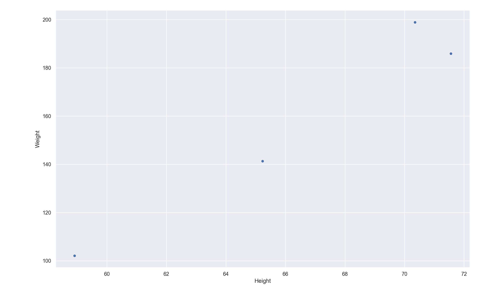
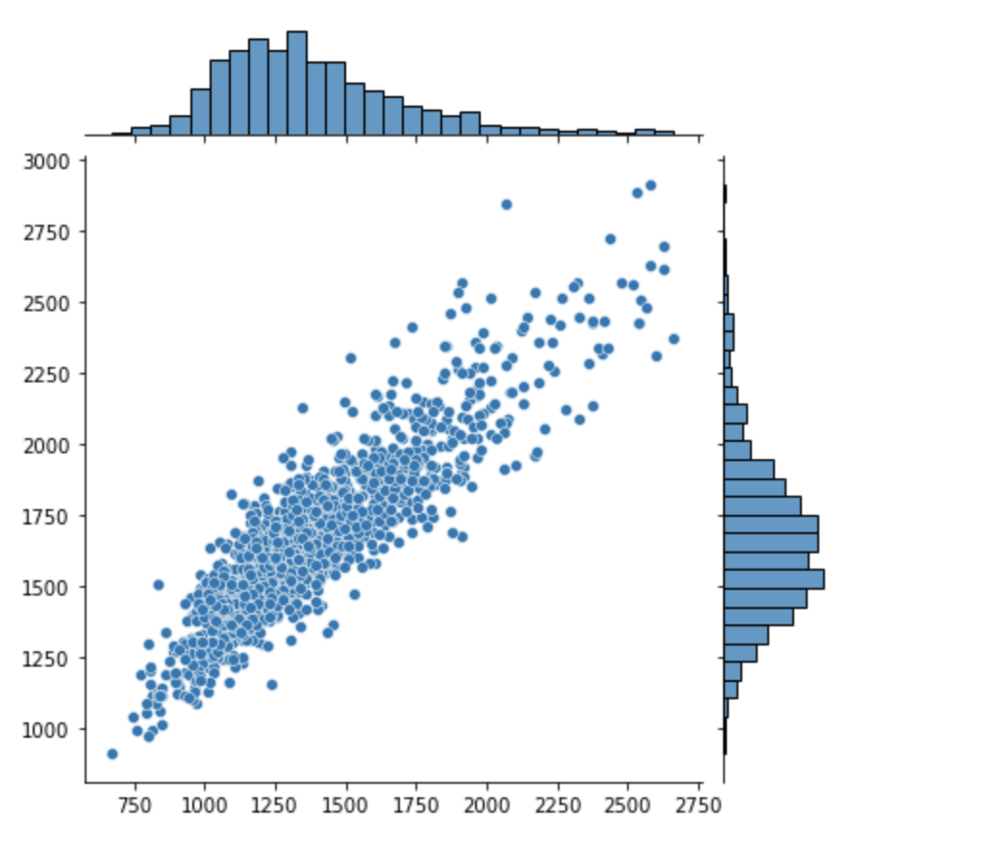

<link rel="preconnect" href="https://fonts.gstatic.com">
<link href="https://fonts.googleapis.com/css2?family=Roboto:wght@400;500;700&display=swap" rel="stylesheet">

<style>
	* {
		font-family: 'Roboto', sans-serif;
	}
	
	h2 {
		border-bottom: none;
		background-color: #3d5afe;
		color: #fff;
		font-weight: bold;
		font-size: 32px;
		margin-bottom: 30px;
		line-height: 64px;
		border-radius: 8px;
		padding-left: 32px;
	}
	
	h3 {
		color: #005ecb;
		text-transform: uppercase;
	}
	
	h4 {
		color: #607d8b;
	}
	
</style>


<h1>Zoisberg 2.0</h1>


<h2>Introduction</h2>

Les évolutions amenées par l'intelligence artificielle transforment petit à petit différents secteurs. Les metiers de la santé ont su parfaitement prendre le train en marche de cette révolution et implémenter différentes solutions de machine learning. Une de ces applications est la prédiction du risque et la détection de maladie chez les patients. Ces nouveaux outils permettent aujourd'hui d'aider les médecins dans leur travail de prévention et de diagnostic afin de soigner les patients plus efficacement.

L'objectif de ce projet est d'assister les médecins dans le dépistage de la pneumonie chez les patients. Pour y parvenir nous allons explorer  différents model de machine learning afin de développer une solition fiable et robuste pour relever ce défi médical.

<h2>Les concepts clés</h2>

<h3>Intelligence artificielle</h3>

L'objectif du développement d'une intelligence artificielle consiste à programmer une machine capable d'imiter les fonctions cognitives humaines, qu'on appelle "intelligence naturelle".

Pendant la plus grande partie de l'histoire de l'informatique, les humaines ont surtout tenter de reproduire le fonctionnement de la pensée logique pour prgrammer des machines capables de résoudre des tâches précises. Cela est rendu possible par création d'alogorithme (suite d'instruction plus au moins complexe) qui va être exectuté par la machine. 

Cependant le point faible d'une approche alogorithmique est le manque de fléxibilité. En effet, sans intervention de l'homme pour modifier l'algorithme, la machine va executer la suite d'instruction toujours de la même manière. De ce fait si mon algorithme prend un Input A comme "information d'entrée", alors il donnera toujours le même Output B comme "information de sortie". De plus le défaut d'un algorithme, est qu'il ne peut pas s'adapter à un cas particulier pour lequel il n'a pas été conçu spécifiquement.

C'est pour cela que les développeur se sont dirigés vers une solution plus fléxible: ***L'intelligence artificielle.***

<h3>Mais qu'est ce que l'intelligence ?</h3>

La caractéristique clé de l'intelligence est l'adaptation.

> L'intelligence est un procesus mise en oeuvre pour atteindre un objectif. Elle est capable de modifier sa configuration logique au cours des différentes tentatives qu'elle expérimente pour atteindre ce but, si elle mesure que l'objectif qui devait être atteint ne l'a pas été, pour qu'a la prochaine tentative ce but soit atteint. 
>

<h3>Machine learning</h3>


<h3>Problème de classification</h3>

C'est un sujet central du machine learning. Voici une définition:

> Problèmes résolues par une machine ayant pour but de grouper des données selon des caractéristiques prédéfinies
> 

L'objectif est d'entrainer une machine à reconnaitre certaines caractéristiques particulières d'une information, pour être capable de traiter et classer des informations futures en fonction de ces critères.

Pour entrainer une machine nous avons besoin d'un ensemble de données qui possèdent les caractéstiques particulières à reconnaitre. Dans cet ensemble, chaque information est associé à la catégorie qui la représente. Grâce à cela la machine va au fil de l'entraintement pouvoir associé certaines cateristiques à la catégories correspondantes. On parle dans cas là d'apprentissage supervisé, car c'est l'intervention humaine qui permet à la machine d'apprendre.

Pour comprendre comment est conçu cet ensemble de données, nous devons introduire un nouveau concept: ***le Dataset***. 

<h3>Dataset</h3>

Le dataset est un ensemble de données classées par catégories selon certaines caractéritiques préféfinies à partir desquelles il est possible de réaliser des statistiques, c'est à dire des prédictions. Ces prédictions vont visé à determiner à partir des caratéritiques prédéfinies, si telle ou telle données appartient à telle ou telle catégorie. 

>Exemple de dataset: Le poids et la taille d'un être humain selon le sexe.

Ici, les caratéristiques prédéfinies sont ***le poids*** et ***la taille***. On peut retrouver un exemple de dataset basé sur ces caratéristiques [sur github](https://gist.github.com/nstokoe/7d4717e96c21b8ad04ec91f361b000cb)

| Gender |      Height      |      Weight      |
|--------|:----------------:|:----------------:|
| Male   | 71.5577184876743 | 185.905909489285 |
|   Male | 70.3518798786343 | 198.903011944154 |
| Female | 58.9107320370127 | 102.088326367840 |
| Female | 65.2300125077128 | 141.305822601420 |

A partir d'un dataset il est possible de réaliser des opérations statistiques qui nous permettent de faire des prédictions. C'est sur ce principe que repose certaines méthodes de machine learning.

#### exemple: Nuage de point

A partir de ce dataset, il est possible de visualiser les données sur un graphique. Les caractéristiques vont être les coordonnées en abscisse (taille) et en ordonnée (poids), et donc à chaque point va correspondre un individu:



Si les caractéristiques correspondent à un individu du genre masculin, on va colorer le point en bleu. Si c'est un individu du genre féminin on va colorer le point en orange. On dit que les points coloré par ***class label***, le genre est la classe qui permet de catégorisé les points.


La question à se poser est la suivante: ***Existe-t-il une ligne qui peut séparer les points de ce nuage, de telle manière que les points corresponsant à une même catégorie soient dans la même zone ?***

Effectivement on peut voir une claire séparation entre les points d'un genre différent. De ce fait, la combinaison de caractéristiques qui correspondent à un homme et celles qui correspondent à une femme sont séparé par une ligne qu'on appelle ***decision boundary***.


Voici donc un version très simplifié de comment peut être résolu un problème de classification (binaire) via une méthode statistique. On implémente des solutions beaucoup plus complèxes pour permettre à tes machine de réaliser des prédictions beaucoup plus compliquées, mais l'idée reste la même.

<h3>Reconnaissance d'image et computer vision</h3>

La reconnaissance d'image va consister à résoudre un problème de classification lorsque les données de départ sont sous la forme d'image. On supérvise dans ce cas l'apprentissage d'une machine dans le but de classer l'image selon différentes classes. 

Cette méthode repose sur la compréhesion de principe de computer vision, c'est à dire la capacité pour une machine à traduire une image en une suite de données (structure de donnée en tableau) pour pouvoir réaliser des opérations à partir de celles ci. En machine learning cette suite de valeur représentent la valeur d'un pixel de l'image et vont représenter les valeurs d'entrées (inputs) d'un model à partir desquelles on va pouvoir faire des prédictions statistiques.

<h2>Exploration des données</h2>

### Présentation du dataset


Chaque dataset représente un ensemble d'image représantant chacune une radio des poumons d'un patient donné. Nous avons 2 conditions dans notre étude: 

+ Poumons infectés par la pneumonie (virus ou bactérie)
+ Poumons sains 

Ce qui implique que notre dataset est strucutré par classe 

```
chest_Xray/
	test/
		PNEUMONIA/
		NORMAL/
	train/
		PNEUMONIA/
		NORMAL/
```

Cependant nous avons juger que pour une meilleur intérprétations des resultats, et afin d'aider plus efficacement le corps médical à soigner plus effecicacemet les causes de la maladie, de détecter si la cause de la maladie est lié à la présence d'une bactérie ou d'un virus. Ce qui implique pour notre dataset une structure différente: 

```
chest_Xray/
	test/
		BACTERIA/
		VIRUS/
		NORMAL/
	train/
		BACTERIA/
		VIRUS/
		NORMAL/
```
 
### Echantillon des images

Voici un échantillon des images que l'on peut retrouver dans un dataset, étiquettés par classes: 


### Visualisation du format des images 

On va visualiser les dimensions de nos images dans le dataset d'entrainement pour connaitre si il existe ou non une trop grande disparité dans les dimensiosn des images (images dans des dimensions trop différentes). En effet nos models ont besoin d'être entrainé sur des images dans des dimensions identiques. Les images réelles sont de fait dans des formats différents. 



### Image Resize et Image Normalization 

Lorsqu'on travaille avec des models de machine learning un des principaux objectifs est le traitement des images. 

On parle de d'***image resize*** ou ***"mise à l'échelle"*** lorsqu'il s'agit de manipuler les données pour qu'elles obtiennent les mêmes dimensions. En effet on obtient de très mauvais résultat lorsque cette opération n'est pas effectuée. De plus dans notre cas la dimension des images est beaucoup trop importante (~ 1380*1668) et notre machine va être à court de mémoire pour faire tourner les models les plus consommateur en ressource.

On parle d'image normalization lorsqu'il s'agit de faire tenir les valeurs de chaque pixel de l'image (présente dans un tableau) entre 0 et 1. Cela permet à la machien de pouvoir extraire de chaque image l'information pertinente qui lui permet véritablement de classer les images par label, indépendament de toute information supperflue. 

Pour réaliser l'opération de mise à l'échelle nous nous sommes appuyé sur la classe ```ImageDataGenerator```
fourni par ```keras```. En effet sur l'appel de la méthode ```flow_from_directory``` d'une nouvelle instance crée à partir de cette classe, il est possible de passer un argumment ```target_size``` qui définit la nouvelle shape de nos images (tableaux de pixel).

Voici une image avant resize:


Voici une image après resize: 


Pour ce qui est de la normalisation des images, après études des données nous avons estimé que la valeur des pixels pour les images était déjà optimale pour un traitement efficace des données par nos models.

### L'augmentation des données 

La ***data augmentation*** ou ***augmentation des données*** va consister à gonfler artificiellement le nombre d'image labelés pour nourir le réseau de neurone à partir d'un dataset de départ souvent peu fourni.Nous avons eu recours à cette méthode pour prévenir ce que l'on appelle l'overfitting, c'est à dire que notre model devient trop spécifiquement entrainé pour notre dataset et obtient de mauvais résultat sur d'autre dataset de test ou cas réels. Nous avons nottament relevé ce problème lorsqu'il s'agit de donnée classé comme bactérie. 

## Présentation des différentes méthodes explorées

### Rappel de l'objectif

Notre objectif va être de réaliser un model capable de prédir à partir d'une image (radio des poumons), si le patient est infecté par une bactérie de la pneumonie, un virus ou si il est sain.

### Les différents models

Voici les différentes pistes que nous avons exploré pour tenter d'obtenir les meilleurs résultat: 

+ ***Logistic Regression (ML linear model)***
+ ***XGBoost (ML gradient boosting)***
+ ***CATBoost (ML gradient boosting)***
+ ***Neural network (CNN)***
+ ***Bayesian model (CNN)***

#### Regression logistique 

L'objectif de cett technique d'apprentissage automatique est de résoudre des problème de classification en se basant sur la relation linéaire qui peut exister entre les pixel passer en entrée (input) et la classe à laquelle l'image peut appartenir (output). Nous avons décider de choisir dans un premier temps ces models car ce sont ceux qui sont les moins couteux en terme de ressources (mise en place et mémoire machine nécessaire) mais ce sont aussi ceux avec les résultats les moins élevés pour les problèmes de classification les plus complèxes. 

#### Gradient boosting

C'est une technique d'apprentissage automatique basé sur les arbres de décisions. Ils sont généralement utlisé pour des problèmes de classification. Les "poids" de noeuds dans l'arbre de décisions sont corrigés au fur et à mesure des tentatives lors de la pahse d'apprentissage. Ces models présentent un bon compromis entre les solutions les plus basiques et celles qui sont les plus couteuses en terme de ressources. 

#### Réseau de neurone 

Un réseau de neurones artificiels est une approche visant à developper une intelligence artificielle. Elle est basé sur l'objectif d'imiter la structure et le fonctionnement d'un réseaux de neurones naturel qu'on peut retrouver dans le cerveau humain. 

Les neurones humains sont mis en relation les uns avec les autres au sein de structure très complèxes et communique au travers de signaux par impulsion electrique. Les réseaux de neurones artificiels sont une tentative d'imiter ces structures et ce fonctionnement de manière simplifié. C'est donc un ensemble de neurone artificiel interconnectés. 

Le neurone artificiel est la brique élémentaire d'une structure plus complexe. Dans le but de simplifier les choses, on peut le résumé à une entité qui possède sa propre configuration interne (en d'autres termes ses propres "réglages") qui peut être modifié au cours du temps. ***Ce n'est pas quelque chose de "figé"***.

Comme un neurone naturel, il peut prendre une ou plusieures "informations" en entrée et en fonction de sa configuration interne, donne une certaine information en sortie. Un neurone artificiel seul est la structure de réseaux de neurone la plus simple avec laquelle on peut travailler.

Dans un réseau de neurone, ces derniers sont organisé en différentes couches. On retrouve les couches d'inputs (les valeurs de chaque pixel de l'image dans notre cas), les couches profondes ("deep" learning) qui permettent par succéssion d'obtenir une valeur d'output. 

Lorsqu'un réseau de neurone arrive à la conclusion qu'il n'a pas fait la bonne prédiction, alors il va changer sa configuration interne pour qu'à la prochaine tentative il puisse obtenir le bon résultat. On parle alors de ***backpropagation***.

Ce sont les models de ML les plus complexes à implémenter et également ceux qui sont les plus consommateurs de ressources pour la machine (temps, mémoire, ...). 

#### Model bayesien 


## Résultats et comparaisons


### Tableau de conclusion


| Nom du model | Précision | Avantages | Inconvénients | Conclusion |
|--------------|-----------|-----------|---------------|------------|
|              |           |           |               |            |

### Matrice

### Interprétation des models 

Faire un point sur l'interprétation des modesl


