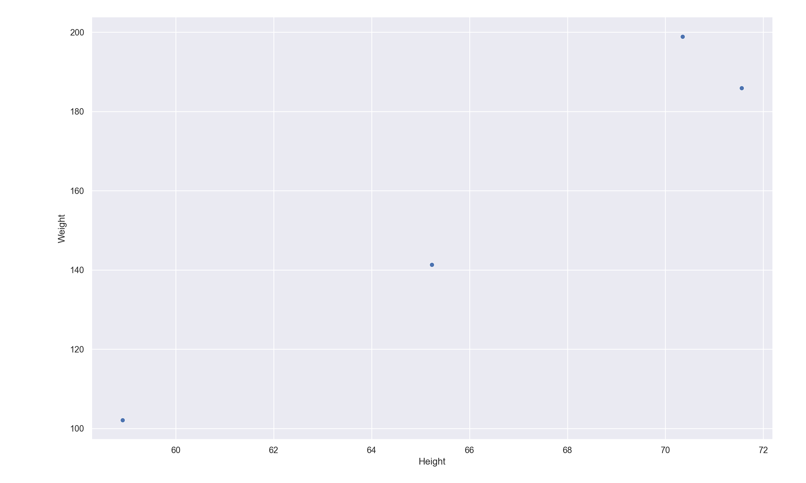
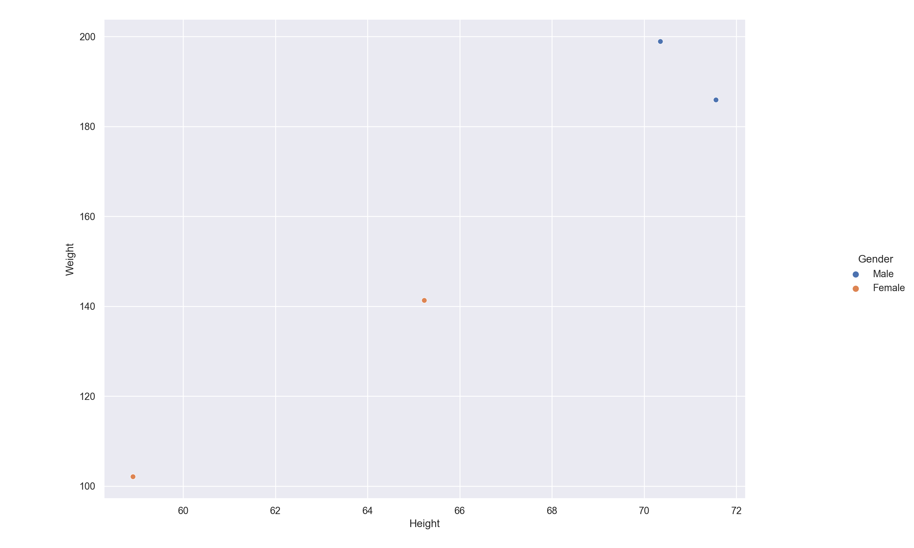
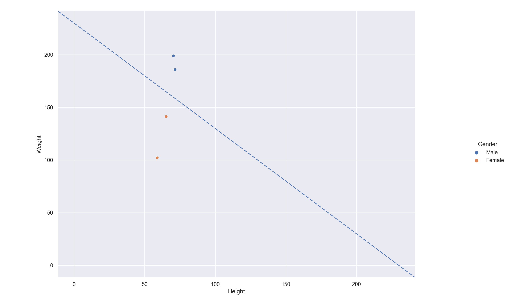
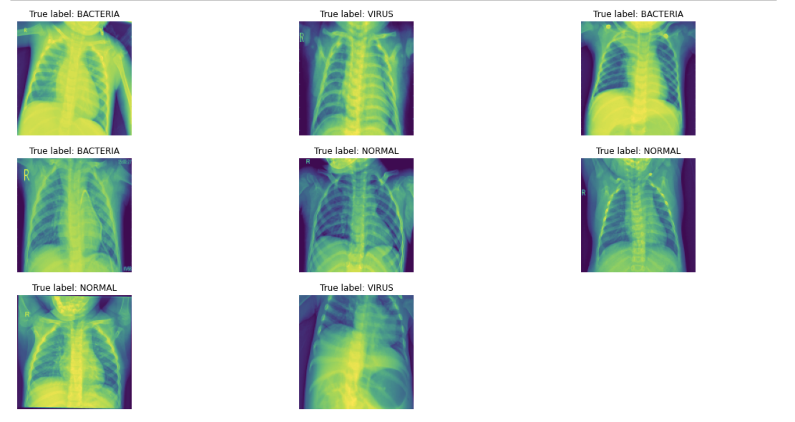
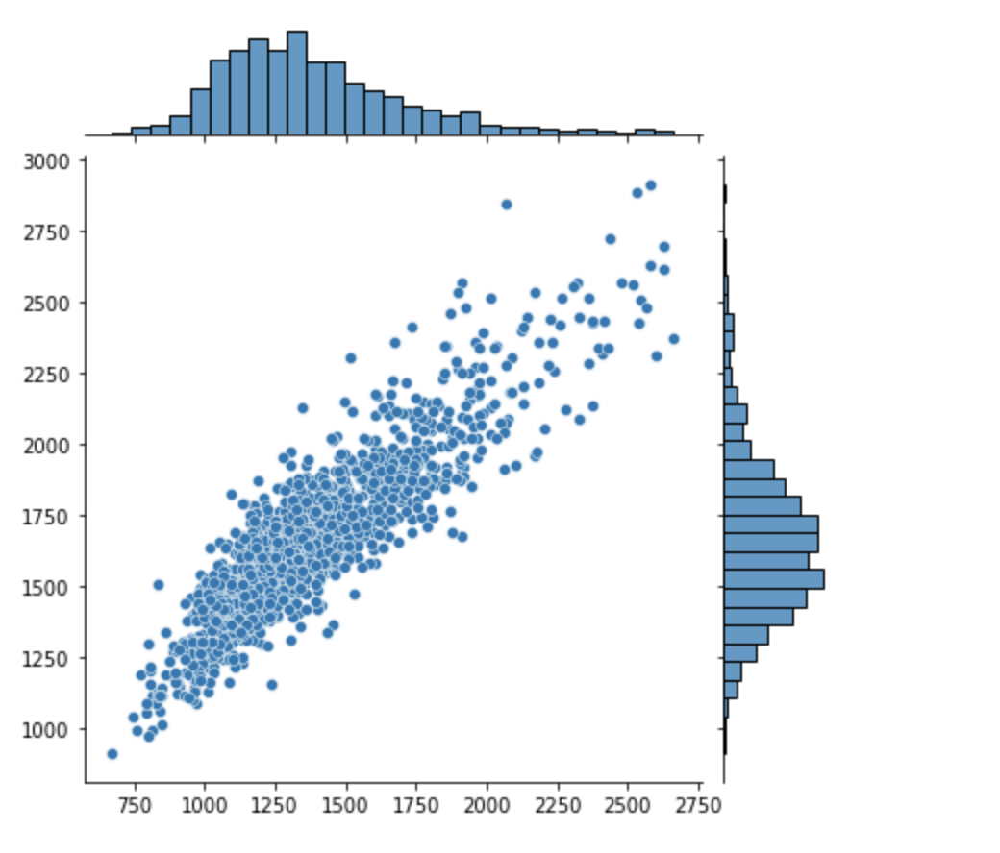
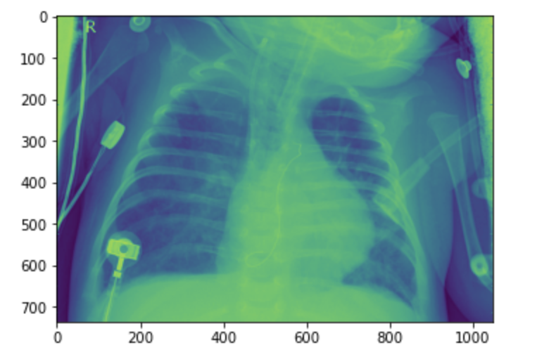
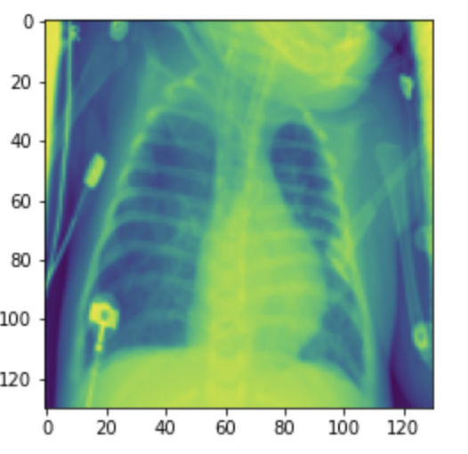

<div class="container-fluid">
    
</div>
            
<h1 style="text-align: center; 
           font-size:50px;
           background-color: #428bca;
           border-radius: 8px;
           line-height: 64px;
           color:#FFFFFF;"> Rapport de synthèse: Zoidberg 2.0 </h1><a id=a></a>


<h1 style="background-color: #428bca; color:#FFFFFF">Introduction</h1>

Les évolutions amenées par l'intelligence artificielle transforment petit à petit différents secteurs. Les metiers de la santé ont su parfaitement prendre le train en marche de cette révolution et implémenter différentes solutions de machine learning. Une de ces applications est la prédiction du risque et la détection de maladie chez les patients. Ces nouveaux outils permettent, aujourd'hui, d'aider les médecins dans leur travail de prévention et de diagnostic afin de soigner les patients plus efficacement.

L'objectif de ce projet est d'assister les médecins dans le dépistage de la pneumonie chez les patients. Pour y parvenir nous allons explorer  différents model de machine learning afin de développer une solution fiable et robuste pour relever ce défi médical.


<h1 style="background-color: #428bca; color:#FFFFFF">Les concepts clés</h1>

<h2>Intelligence artificielle</h2>

L'objectif du développement d'une intelligence artificielle consiste à programmer une machine capable d'imiter les fonctions cognitives humaines, qu'on appelle "intelligence naturelle".

Pendant la plus grande partie de l'histoire de l'informatique, les humaines ont surtout tenter de reproduire le fonctionnement de la pensée logique pour programmer des machines capables de résoudre des tâches précises. Cela est rendu possible par la création d'algorithmes (suite d'instructions plus au moins complexe) executés par la machine. 

Cependant le point faible d'une approche alogorithmique est le manque de fléxibilité. En effet, sans intervention de l'homme pour modifierce derniers, la machine va executer la suite d'instruction de la même manière. De ce fait si l'algorithme prend un Input A comme "information d'entrée", alors il donnera toujours le même Output B comme "information de sortie".

C'est pour cela que les statisticiens et chercheurs se sont tournés vers ***L'intelligence artificielle.***

<h3>Mais qu'est ce que l'intelligence ?</h3>

La caractéristique clé de l'intelligence est l'adaptation.

> L'intelligence est un procesus mise en oeuvre pour atteindre un objectif. Elle est capable de modifier sa configuration logique au cours des différentes tentatives qu'elle expérimente pour atteindre ce but, si elle mesure que l'objectif qui devait être atteint ne l'a pas été, pour qu'a la prochaine tentative ce but soit atteint. 

<h2>Machine learning</h2>

<h3>Problème de classification</h3>

C'est un sujet central du machine learning. Voici une définition:

> Problèmes résolues par une machine ayant pour but de grouper des données selon des caractéristiques prédéfinies.

L'objectif est d'entrainer une machine à classifier une instance comme appartenant à un groupe sur la base critères d'entrés.

Pour entrainer une machine nous avons besoin d'un ensemble de données représentant n instances ou individus. Dans cet ensemble, chaque instance est associé à la catégorie qui la représente. Grâce à cela la machine va au fil de l'entrainement pouvoir associer certaines cateristiques à la catégorie correspondante. On parle dans ce cas là d'apprentissage supervisé, car c'est la labellisation préalable par l'humain qui permet à la machine d'apprendre.

>Exemple de dataset: Le poids et la taille d'un être humain selon le sexe.

Ici, les caratéristiques prédéfinies sont ***le poids*** et ***la taille***. On peut retrouver un exemple de dataset basé sur ces caratéristiques [sur github](https://gist.github.com/nstokoe/7d4717e96c21b8ad04ec91f361b000cb)

| Gender |      Height      |      Weight      |
|--------|:----------------:|:----------------:|
| Male   | 71.5577184876743 | 185.905909489285 |
|   Male | 70.3518798786343 | 198.903011944154 |
| Female | 58.9107320370127 | 102.088326367840 |
| Female | 65.2300125077128 | 141.305822601420 |

A partir d'un dataset il est possible de réaliser des opérations statistiques qui nous permettent de faire des prédictions. C'est sur ce principe que repose certaines méthodes de machine learning.

#### exemple: Nuage de point

A partir de ce dataset, il est possible de visualiser les données sur un graphique. Les caractéristiques sont en abscisse (taille) et en ordonnée (poids), et donc à chaque point va correspondre un individu:



Si les caractéristiques correspondent à un individu du genre masculin, on va colorer le point en bleu. Si c'est un individu du genre féminin on va colorer le point en orange.



La question à se poser est la suivante: ***Existe-t-il une ligne qui peut séparer les points de ce nuage, de telle manière que les points corresponsant à une même catégorie soient dans la même zone ?***

Effectivement on peut voir une claire séparation entre les points d'un genre différent. De ce fait, la combinaison de caractéristiques qui correspondent à un homme et celles qui correspondent à une femme sont séparé par une ligne qu'on appelle ***decision boundary***.



Voici donc un version très simplifié de comment peut être résolu un problème de classification (binaire) via une méthode statistique. 

<h3>Reconnaissance d'image et vision par ordinateur</h3>

La reconnaissance d'image va consister à résoudre un problème de classification lorsque les données sont des images. 

En effet, nous pouvons voir une image comme un ensemble de données regroupés sous forme de matrice et chaque pixel représente une valeur. Cette matrice sera alors la donnée d'entrée pour notre modèle.


<h1 style="background-color: #428bca; color:#FFFFFF">Exploration des données</h1>

Après cette brève introduction au monde du machine learning, nous abordons le sujet principal. Il est question ici de créer une IA afin d'aider le corps médical face à la pneumonie. Nous devrons alors créer un modèle performant mais aussi interpretable.

<h2 style="background-color: #428bca; color:#FFFFFF">Présentation des datasets</h2>


Chaque dataset représente un ensemble d'images de radio des poumons. Nous avons 2 classes dans notre étude: 

+ Poumons infectés par la pneumonie (virus ou bactérie)
+ Poumons sains 

Nos données se trouvent sous la forme:

```
chest_Xray/
	test/
		PNEUMONIA/
		NORMAL/
	train/
		PNEUMONIA/
		NORMAL/
```

Cependant nous avons juger que pour une meilleur interprétations des résultats, et afin d'aider le corps médical à soigner la pneumonie, nous classifierons ces images en trois catégories: NORMAL, BACTERIA et VIRUS. Ce qui implique une structure différente: 

```
chest_Xray/
	test/
		BACTERIA/
		VIRUS/
		NORMAL/
	train/
		BACTERIA/
		VIRUS/
		NORMAL/
```

### Set d'entrainement,  de validation et de test

Au vu des quantités d'images, nous avons décidé de séparer le jeu d'entrainement et de validation de manière basique. Nous n'effectuerons pas de validation croisée. En  effet, cela peut se révéler inutile si notre jeu de validation est assez représentatif de notre jeu d'entrainement. De plus, cela nous fera gagner du temps de calcul.

Voici donc nos jeux d'entrainement/validation:


Pour s'assurer que le jeu de validation était bien représentatif du jeu d'entrainement, nous avons analysé les valeurs des pixels comme suit:


Nous pouvons conclure de ces histogrammes que nos deux jeux sont identiques.


<h2 style="background-color: #428bca; color:#FFFFFF">Prétraitement des données</h2>

Le prétraitement des données est primordiale pour corriger/améliorer le modèle.
 
### Echantillon des images

Voici un échantillon des images que l'on peut retrouver dans nos sets, étiquettés par classes: 



### Visualisation du format des images 

On va visualiser les dimensions de nos images dans le dataset d'entrainement pour connaitre si il existe ou non une trop grande disparité dans les dimensiosn des images (images dans des dimensions trop différentes). En effet nos models ont besoin d'être entrainé sur des images dans des dimensions identiques. Les images réelles sont de fait dans des formats différents. 



### Normalisation des valeurs et redimensionnement

On parle de ***"mise à l'échelle"*** lorsqu'il s'agit de manipuler les données pour qu'elles obtiennent les mêmes dimensions. En effet, c'est un prérequis obligatoire pour l'entrainement de notre IA. De plus dans notre cas certaines dimensions etaient beaucoup trop élevées (~ 1380*1668) ce qui peut avoir un impact très négatif sur le temps de calcul.
Nous avons décider de réduire les dimension à 127*127 car cela correspond à la plus faible valeur trouvée dans le jeu d'entrainement.

On parle de ***normalisation d'image*** lorsqu'il s'agit de faire tenir les valeurs de chaque pixel entre 0 et 1. Cela permet à notre modèle de ne pas être sensible aux valeurs extrêmes.

Pour réaliser l'opération de mise à l'échelle nous nous sommes appuyé sur la classe ```Dataset```
fourni par ```Tensorflow```. En effet sur l'appel de la méthode ```map```  nous pouvons définir plusieurs fonctions pour redéfinir nos images.

Voici une image avant traitement:



Voici une image après traitement: 



Pour ce qui est de la normalisation des images, après études des données nous avons remarqué que les valeurs étaient déja comprises entre 0 et 1.

### Diminution des dimensions (ML)

Nous avons eu recours à la diminution de dimensions car les algorithmes classiques de machine learning ne sont pas optimisés pour les cas de grands espaces, leur temps d'entrainements ne seraient pas raisonnables. Il est alors possible de supprimer les pixels qui n'apportent pas d'informations ou de recréer un espace qui maximise la quantité d'information sur les premiers composants. 

Nous avons essayer plusieurs algorithmes comme: 

 - L'analyse en composante principale: Recréer un espace qui maximise la variance.
 - Test du chi2: Suppression des pixels sans information.
 - Test ANOVA: Suppression des pixels sans information.
 - Critère d'information mutuel: Suppression des pixels sans information.

nous avons décidé au vu des résultats de nous baser sur le test ANOVA. En effet, comme le confirme les images suivantes, Chi2 et le critère IM prennent en compte des pixels inutiles qui sont souvent causes de sur-ajustement. La transformation par la méthode ACP ne donne pas une image compréhensible par l'homme et ainsi l'interpretation finales en est plus compliquée.


### L'augmentation des données (réseaux de neurones)

La ***data augmentation*** ou ***augmentation des données***  consiste à modifier nos images d'entrées en y appliquant des fonctions de prétraitements. Nous avons eu recours à cette méthode pour prévenir du sur-apprentissage, c'est à dire la focalisation du modèle sur des détails trop spécifiques à notre jeu d'entrainement. Par exemple, notre jeu comporte plus d'images classifiées comme bactérie, il pourrait alors se focaliser sur des détails présents dans ces images et qui ne sont pas généralisables sur les deux autres classes. 

<h1 style="background-color: #428bca; color:#FFFFFF">Présentation des différentes méthodes explorées</h1>

<h2 style="background-color: #428bca; color:#FFFFFF"> Rappel de l'objectif</h2>

Notre objectif est de réaliser un model capable de prédire à partir d'une image (radio des poumons), si le patient est infecté par la pneumonie sous la forme bactérienne ou virale ou s'il est sain.

<h2 style="background-color: #428bca; color:#FFFFFF">Les différents modèles</h2>

Voici les différentes pistes que nous avons exploré: 

+ ***Logistic Regression (ML linear model)***
+ ***XGBoost (ML gradient boosting)***
+ ***CATBoost (ML gradient boosting)***
+ ***Neural network (CNN + modèle bayesien)***
+ ***Optimisation bayésienne***
+ ***Transfert de connaissances***

### Régression logistique 

L'objectif de cette technique d'apprentissage automatique est de résoudre des problèmes de classification en se basant sur la relation linéaire qui existe entre les pixels (input) et sa classe (output). Nous l'avons choisi pour sa rapidité, il représente aussi une bonne base de prédiction.

### Gradient boosting

C'est une technique d'apprentissage automatique basé sur la concaténation de plusieurs classifieurs faibles (arbres de décision) qui pris indépendamment donnent de mauvais résultats mais une fois regroupés peuvent rivaliser avec les modèles de deep learning les plus complexes. Ces modèles présentent un bon compromis entre les solutions les plus basiques et celles qui sont les plus couteuses en terme de ressources. 

### Réseau de neurone 

Un réseau de neurones artificiels est une abstraction du cerveau humain. 

Les neurones humains sont mis en relation les uns avec les autres au sein de structure très complexes et communique au travers de signaux par impulsion électrique. Les réseaux de neurones artificiels sont une tentative d'imiter ces structures et ce fonctionnement de manière simplifié. 

Le neurone artificiel est la brique élémentaire d'une structure plus complexe. Dans le but de simplifier les choses, on peut le résumé à une entité qui possède sa propre configuration interne (en d'autres termes ses propres "réglages") qui peut être modifié au cours du temps. ***Ce n'est pas quelque chose de "figé"***.

Dans un réseau de neurones, ces derniers sont organisés en différentes couches. On retrouve les couches d'inputs (les valeurs de chaque pixel de l'image dans notre cas), les couches profondes ("deep" learning) qui permettent par succession d'obtenir une valeur d'output. 

Une fois la fonction de perte calculée (erreur du modèle généralement l'entropie croisée) la fonction de ***backpropagation*** réajuste les poids pour minimiser l'erreur.

Ce sont les modèles de machine learning les plus complexes à implémenter et également ceux qui sont les plus consommateurs de ressources pour la machine (temps, mémoire). 

### Optimisation bayesienne 

Le principe de l'optimisation bayesienne est de trouver automatiquement les meilleurs hyperparamètres (paramètres qui ne sot pas appris automatiquement) d'un modèle. C'est à dire de minimiser la fonction de perte en fonction de ses hyperparamètres. Ainsi, nous nous évitons du temps de calculs que nous aurions pu avoir avec une fonction classique de gridsearch.

### Model bayésien 

Le modèle bayésien est une forme probabiliste d'un algorithme de machine learning. Il ne vise pas à prédire une simple probabilité d'appartenance à une classe mais aussi à définir un intervalle de confiance, ainsi nous avons des indications lorsque notre modèle doute. Le modèle bayésien n'est pas propre aux réseaux de neurones.

### Transfert de connaissances et Fine tuning

Le principe du transfert de connaissances est d'utiliser un modèle pré-entrainé de classification. Généralement, les réseaux de neurones encodent les informations très générales dans les couches les plus basses du modèle et les détails dans les couches proches de la sortie. Ainsi, un modèle pré-entrainé pour de la classification, quelque soient les classes, aura tendance à converger plus rapidement et obtenir des meilleurs résultats car les informations basiques tel que la reconnaissance de cercles, droites etc... seront déjà apprises. 

<h2 style="background-color: #428bca; color:#FFFFFF">Résultats et comparaisons</h2>

### Métriques utilisés
Nous avons utilisés plusieurs métriques tels que la précision, le recall, roc auc et le score f1. Cependant, seulement le score ROC AUC "macro" tranchera entre tous. C'est un indcateur sur la capacité qu' notre modèle probabilité à donner de bonnes classifications. Aussi, étant donné qu'il prend en compte le seuil de décision, nous avons donc une quantification de notre incertitude.

### Tableau de conclusion

D'après notre notebook, nous pouvons dresser le tableau suivant:


| Nom du model | ROC AUC score| Avantages | Inconvénients | Conclusion |
|--------------|-----------|-----------|---------------|------------|
|Regression logistique| 0.839| Fast| modèle linéaire| pas pris en compte
|XGBClassifier| 0.907| facilement interprétable et précis| Moyennement rapide |pris en compte
|CatBoostClassifier|0.906| facilement interprétable et précis| Moyennement rapide| Pas pris en compte
|Réseau de neurones (SeNet)| 0.904| Précis| Pas facilement interprétable/long à entrainer| Pas pris en compte 
|Réseau de neurones (transfert de connaissances)| 0.936|Très précis et rapide à entrainer| PAs facilement itnerprétable| Pris en compte

Ainsi le réseau pré-entrainé donne de meilleurs résultats.

### Matrice des métriques et de confusion.

Nous appliquons les métriques citées au-dessus.

**Voici nos résultat pour le XGBClassifier:**


**Voici nos résultats pour notre réseau de neurones:**


Evidemment, sans grande surprise le modèle pré-entrainé est plus performant à tous les niveaux et de plus il converge très rapidemment.

### Exemple

Voici quelques exemples de classifications avec notre modèle XGBClassifier:


Voici quelques exemples de classifications avec notre modèle MobileNetV2:


### Interprétation des modèles 

L'interprétation de chaque modèle est très important. Différents outils existent afin d'analyser les pixels qui jouent un rôle décisif dans la classification. Malheureusement nous ne possédons uniquement ces valeurs pour le XGBClassifier.

Voici nos résultats pour le XGBClassifier:

Sur cette image, l'intensité des pixels signifie une importance plus grande pour notre modèle.


Cependant, cela ne nous donne guère de détails quant à chaque classification. Pour cela nous utiliserons la shap values:


En rouge se trouvent les pixels qui pèsent favorablement dans la classification NORMAL et en bleu les pixels qui ont tendances à la faire diminuer. Ainsi, dans cette exemple, nous distinguons 3 images représentant respectivement les 3 classes NORMAL, BACTERIA et VIRUS. Pour chaque image, nous pouvons voir le score d'appartenance à la classe NORMAL qu'a attribué le modèle et les pixels associés.

### Probabilité

Il est important d'associer à nos scores leurs intervalles de confiance:
Ces scores ne sont disponibles que pour le modèles XGBClassifier, le réseau de neurones, étant pré-entrainé, ne prend pas en compte de couches bayesiennes.

Ici 0 signifie NORMAL, 1 BACTERIA et 2 VIRUS.


<h1 style="background-color: #428bca; color:#FFFFFF">Conclusion</h1>

Le réseau de neurone MobileNetV2 est le plus performant mais nous avons vu que les modèles "classiques" sont beaucoup plus interpretables ce qui n'est pas négligeable dans ce domaine. Aussi, ne serait-il pas mieux d'avoir préférable de disposer d'un modèle simple et probabiliste quitte à perdre en précision?
